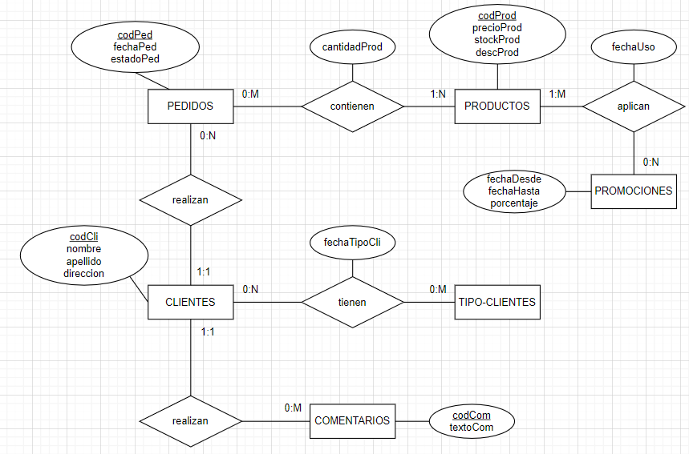

# Propuesta TP DSW - ISI com 302 - 2025

## Grupo
### Integrantes
·        Caracchi, Victoria - 53482  
·        Ponce, Lautaro - 52898  
·        Reschini, Enrico - 52973  
### Repositorios
* [fullstack app](https://github.com/Enri3/fullstack-DSW)

## Tema
### Descripción
Plataforma web dedicada a la venta de productos de un emprendimiento, en este caso de velas artesanales. La idea es que existan distintos tipos de clientes: Inicial, Medium o Premium, cada uno con diferentes niveles de descuentos, quienes pueden realizar compras mediante el uso de mercado pago de manera virtual aplicando estos descuentos a través de la página. El sistema además de poder gestionar los pagos, tendrá un/os usuario/s administradores capaces de gestionar productos, pedidos y usuarios de forma eficiente.

### Modelo

## Alcance Funcional 

### Alcance Mínimo

Regularidad:
|Req|Detalle|
|:-|:-|
|CRUD simple|1. CRUD Productos 2. CRUD Promociones 3. CRUD Clientes|
|CRUD dependiente|1. CRUD Pedidos (depende de Clientes y Productos). 2. CRUD UsosPromociones (depende de Productos, Promociones y Tipos de clientes).|
|Listado + detalle| 1. Listado de productos mostrando nombre, precio y stock disponible => detalle CRUD Producto. 2. Listado de pedidos filtrado por fecha o cliente, mostrando número de pedido, estado, fecha, total a abonar => detalle CRUD Pedido.|
|CUU/Epic|1. Comprar productos. 2. Administrar stock y gestionar pedidos.|

Adicionales para Aprobación
|Req|Detalle|
|:-|:-|
|CRUD |1. CRUD Productos 2. CRUD Promociones 3. CRUD Clientes 4. CRUD TipoClientes 5. CRUD Promociones 6. CRUD Pedidos 7. UsoPromociones|
|CUU/Epic|1. Comprar productos aplicando descuentos. 2. Gestión completa de pedidos (crear, actualizar, cambiar de estado: procesado, enviado,entregado). 3. Comentar productos.|

### Alcance Adicional Voluntario

|Req|Detalle|
|:-|:-|
|Listados |1. Listado/Reporte de uso de descuentos, filtrado por rango de fechas, descuento o producto. 2. Historial de compra del cliente, mostrando productos adquiridos y fecha.|
|CUU/Epic|1. Cancelación de pedidos en estado pendiente. 2. Revisión de comentarios por parte del administrador.|
|Otros|1. Envío de mail de confirmación de compra.|
